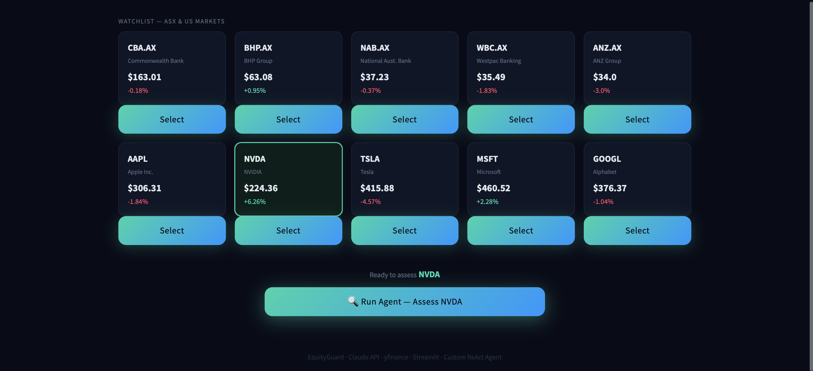
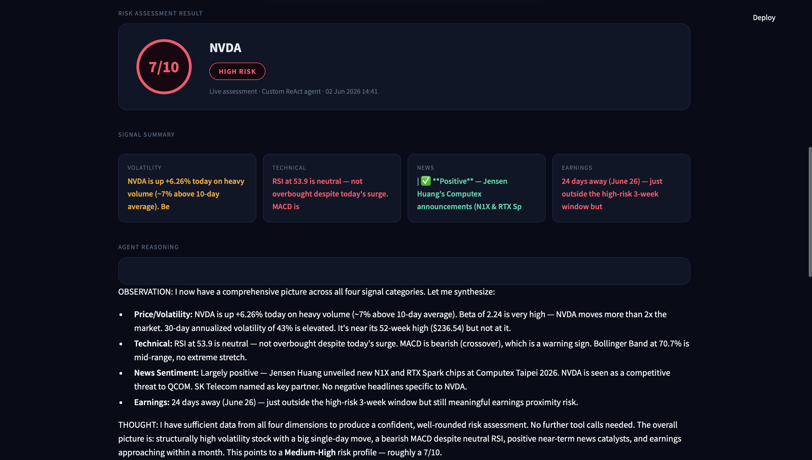

# EquityGuard

I built this because I invest in ASX stocks and wanted something that could investigate a stock properly before I make a decision  not just show me a price chart, but actually reason about the risk.



---

## What it does

You pick a stock. The agent investigates it across multiple signals and comes back with a risk score and a plain English explanation of why.



---

## Why it's genuinely agentic

Most AI finance tools call a fixed sequence of APIs and paste the results into a prompt. That's a pipeline, not an agent.

EquityGuard uses a ReAct loop — the model reads what it finds at each step and decides what to investigate next. The path isn't preset. If it spots unusual volume it goes to check news. If earnings are in 3 days it flags that as the dominant risk. If early signals are clearly low risk it stops early and explains why.

```
You ask: "How risky is CBA.AX?"

Agent:  I need baseline price data first          → calls get_price_data
Agent:  Volume is only 36% of average — unusual  → calls get_news_sentiment  
Agent:  Found a mortgage slowdown headline        → calls get_earnings_risk
Agent:  Earnings already reported — not a factor → calls search_company_knowledge
Agent:  Internal doc confirms margin pressure     → enough, synthesise

Result: 5/10 Medium risk — here's exactly why
```

The agent chose that path. It's not in the code — it's in the model's reasoning.

---

## Architecture

```
equityguard/
├── api/                        # FastAPI REST backend
│   ├── main.py                 # /analyse, /price, /evaluate endpoints
│   └── schemas.py              # Pydantic request/response models
│
├── src/
│   ├── agent/
│   │   ├── react_loop.py       # Custom ReAct loop — Think → Act → Observe
│   │   ├── prompts.py          # System prompt that drives agent reasoning
│   │   ├── tool_registry.py    # Tool registration and dispatch
│   │   └── trace.py            # Records every agent step for evaluation
│   │
│   ├── tools/                  # Each tool is a standalone module
│   │   ├── price_data.py       # Live price, volume, beta, volatility
│   │   ├── technicals.py       # RSI, MACD, Bollinger Bands
│   │   ├── news.py             # Recent headlines via yfinance
│   │   └── earnings.py         # Days to next earnings report
│   │
│   ├── rag/                    # Document retrieval layer
│   │   ├── retriever.py        # Keyword search (vector upgrade ready)
│   │   ├── ingest.py           # ChromaDB vector ingestion pipeline
│   │   └── chunking.py         # Text chunking for embeddings
│   │
│   ├── safety/
│   │   └── financial_guardrails.py  # Blocks financial advice requests
│   │
│   ├── evaluation/
│   │   ├── evaluator.py        # Runs automated test suite against the agent
│   │   └── test_cases.py       # 6 test cases covering normal + edge cases
│   │
│   └── utils/
│       └── config.py           # Central config — API keys, model settings
│
├── frontend/                   # React + Vite + Tailwind UI
├── data/company_docs/          # Internal risk documents for RAG retrieval
├── tests/                      # 23 pytest unit tests, no API calls needed
├── Dockerfile                  # Production container
├── .github/workflows/ci.yml    # GitHub Actions CI pipeline
├── app.py                      # Streamlit UI (alternative to React frontend)
└── main.py                     # CLI interface
```

---

## The ReAct loop

The entire agent is ~80 lines in `src/agent/react_loop.py`:

```python
while iteration < MAX_ITERATIONS:
    response = client.messages.create(
        model=MODEL,
        tools=TOOL_SCHEMAS,    # Claude sees all available tools
        messages=messages      # Full conversation history every turn
    )
    if response.stop_reason == "end_turn":
        return final_answer, trace    # Agent decided it's done
    elif response.stop_reason == "tool_use":
        result = execute_tool(...)    # Run whatever tool Claude chose
        messages.append(result)       # Feed result back → loop again
```

No framework. No magic. A while loop and an API call.

---

## Tech stack

| Layer | Technology |
|---|---|
| Agent brain | Anthropic Claude API (`claude-sonnet-4-6`) |
| REST API | FastAPI + Uvicorn |
| Price & volatility | `yfinance` |
| Technical indicators | Custom RSI, MACD, Bollinger (pandas) |
| News sentiment | yfinance news feed |
| RAG retrieval | Keyword search → ChromaDB vector upgrade path |
| Web UI | React + Vite + Tailwind CSS |
| Demo UI | Streamlit |
| Tests | pytest — 23 tests, zero API calls |
| CI | GitHub Actions |
| Container | Docker |

---

## Running locally

```bash
git clone https://github.com/Ibrahimsheriiff/equityguard.git
cd equityguard

pip install -r requirements.txt
echo 'ANTHROPIC_API_KEY=your-key' > .env

# FastAPI backend
python3 -m uvicorn api.main:app --reload
# → http://localhost:8000/docs

# React frontend (separate terminal)
cd frontend && npm install && npm run dev
# → http://localhost:5173

# Or Streamlit UI
python3 -m streamlit run app.py
```

## Running with Docker

```bash
docker build -t equityguard-api .
docker run -p 8080:8080 --env-file .env equityguard-api
# → http://localhost:8080/docs
```

## Running tests

```bash
python3 -m pytest tests/ -v
# 23 tests — guardrails, technical indicators, evaluation framework
```

---

## Sample output

```
RISK ASSESSMENT: CBA.AX

Overall risk score: 5/10 (Medium)

Key risk factors:
- Sector headwinds: Reuters flags slowing mortgage lending and rising provisions
- Elevated volatility: 36.9% annualised — high for a major bank
- RSI at 68.6 approaching overbought on below-average volume

Signal summary:
- Volatility:  ⚠️  30d vol 36.9%, beta 0.83, 15% off 52w high
- Technical:   ⚠️  RSI 68.6, MACD bullish but volume at 36% of average
- News:        🔴  Mortgage slowdown headline is a material fundamental risk
- Earnings:    ✅  Already reported — no imminent event risk

Recommendation: Monitor for RSI rejection near 70 and watch Australian
credit quality data — consider a protective stop near $147 support.
```

---

## What I built and why

Built as a personal investing tool and as a demonstration of production-grade agentic AI engineering — custom ReAct loop from scratch, RAG document retrieval, financial safety guardrails, automated evaluation framework, FastAPI backend, React frontend, Docker containerisation, and CI/CD.

The architecture is designed to scale: swap the keyword retriever for ChromaDB vector search, deploy the FastAPI container to GCP Cloud Run, and point the frontend at the production URL.

---

*Claude API · yfinance · FastAPI · React · Streamlit · Docker · GitHub Actions · No agent frameworks*